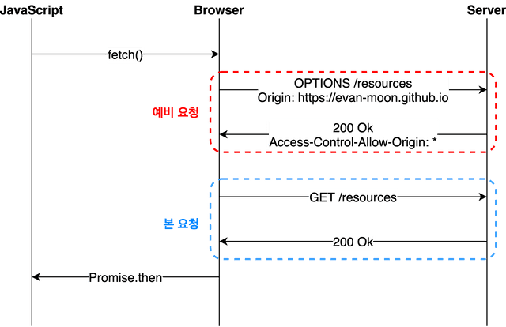
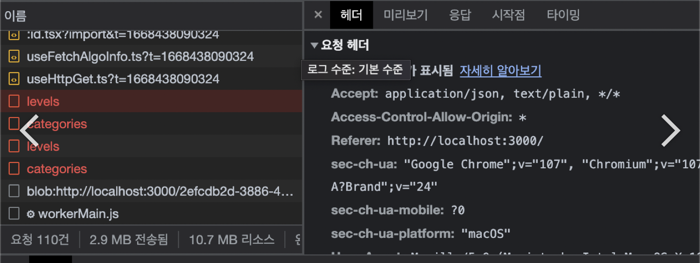

###
HTTP 완벽가이드 1 3장 정리

## 목차

1. [메시지의 흐름](#메시지의-흐름)
2. [메시지의 각 부분](#메시지의-각-부분)

### target
- 메시지가 어떻게 흘러가는가
- HTTP 메시지의 세 부분(시작줄, 헤더, 개체 본문)
- 요청과 응답 메시지의 차이
- 요청 메시지가 지원하는 여러 기능(메서드)들
- 응답 메시지가 반환하는 여러 상태 코드들
- 여러HTTP 헤더들은 무슨 일을 하는가

# 메시지의 흐름
HTTP 메시지의 흐름방향에 따른 용어를 처음 알았어요.
'인바운드', '아웃 바운드', '업스트림', '다운스트림'

# 메시지의 각 부분
## 메시지 문법
요청 메시지

<메서드> <요청 URL> <버전>

<헤더>

\
<바디>
---
응답 메시지

<버전> <상태 코드> <사유 구절>

<헤더>


<바디>

---
### 사유구절
위 문법 중에 가장 눈에 띄었던 것은 사유구절이에요.
'HTTP/1.0 200 NOT OK'와 'HTTP/1.0 200 OK'는 사유 구절이 서로 전혀 달라 보임에도 불구하고 동등하게 성공을 의미하는 것으로 처리되어야 한다.

라는 글을 보고 사유 구절이 의미하는 것은 인간이 인식할 수 있는 문장의 영역이라고 생각했어요.
즉 사유구절이 어떠한 명령어로 작용해서 프로그램 혹은 다른 무언가에 영향력을 발생 시키지 않는 것을 의미해요.

#### 헤더의 빈 줄(CRLF)
헤더나 바디는 본문이 없더라도 HTTP 헤더의 집합은 항상 빈 줄(그냥 CRLF)로 끝나야 함에 주의하라. 는 말을 처음 들었어요.
우리가 함수 가 끝나는 "}"에 줄띄움을 하나 하는 느낌과 유사하다면 유사할 수 있다고 생각해요.

#### CRLF Injection
Carriage Return Line feed Injection의 약자로 각 개행문자를 의미하는 CR(\r) LF(\n)을 이용하여 HTTP Request 또는 Response를 분리하여 공격자가 의도한 동작을 수행시키는 공격 기법을 의미합니다.


CRLF - HTTP 응답 분할 공격(CWE-113)은 응답에 줄 바꿈 문자 CR / LF가 포함되면 HTTP응답이 분리되는 경우를 응용한 공격이다. 
줄 바꿈 문자를 삽입해 여러 개의 HTTP 응답을 만들어 냄으로써 
캐시 서버(Cache Server)나 프록시 서버(Proxy Server)에 변조된 컨텐츠를 전송해 다른 사용자에게 영향을 준다.
- CR(Carriage Return: \r) : 커서의 위치를 현재 줄의 맨 처음으로 보내는 기능
- LF(Line Feed: \n) : 커서를 다음 줄로 옮기는 기능

HTTP Request 내 사용자 입력이 Response에 반영되는 부분이 주요 포인트이며, Request에서 \r\n 즉 %0d, %0a를 이용하여 개행할 수 있다면 취약한 것으로 볼 수 있습니다.

CRLF를 이용하여 응답 패킷을 두 개 이상으로 분리하면서 원래의 HTTP Response와 별개로 새로운 HTTP Response를 만들어 조작할 수 있다는 점에서 취약성이 드러난다.

#### 예시
정상 예시
```http request
GET /redirect?location=/abcd%0d%0a1234

HTTP/1.1 200 OK
Location: /abcd
1234
```

비정상 예시 1 (Add cookie)

CRLF Injection 구문이 헤더에 반영되는 경우 임의로 쿠키를 삽입할 수 있습니다.
```http request
GET /redirect?location=ws://%0d%0aSet-Cookie: session=attackersessions;

HTTP/1.1 200 OK
Location: ws://
Set-Cookie: session=attackersessions;
```
비정상 예시 1 (XSS)

CRLF Injection 구문이 헤더에 반영되는 경우 \r\n\r\n 과 같이 두번 개행하여 Response body 영역에 임의로 HTML 코드를 추가하여 XSS와 동일하게 사용자 브라우저에서 스크립트를 실행할 수 있습니다.
```http request
GET /redirect?location=ws://%0d%0a%0d%0a<svg/onload=alert(45)>

HTTP/1.1 200 OK
Location: ws://

<svg/onload=alert(45)>
```

#### Defensive techniques
사용자 입력 값에서 CR(\r)LF(\n)가 실제 개행되어 반영되지 않도록 제한합니다.

#### 메서드
##### OPTIONS
OPTIONS 메서드를 쓰는 이유에 대해서 알아보고 싶어졌어요.
이유는 개발중 CORS 문제와 연관성이 있기 때문이에요.



##### CORS란?

    웹 브라우저에서 외부 도메인 서버와 통신하기 위한 방식을 표준화한 HTTP 헤더 기반 메커니즘이에요.
    클라이언트와 서버가 서로 다른 도메인일 경우(HTTP 헤더의 origin이 다른 경우)가 있으므로 CORS 기술이 도입 되었어요.
    CORS는 웹 브라우 저가 만들고 실행하는 도메인이 달라도 리소스에 액세스할 수 있도록 하는 보안 메커니즘 
    (원래는 다르면 안주는 게 맞음)
    달라도 줄 것이냐? 말 것이냐? 특정 도메인에만 허락할 것이냐? 모든 도메인에 허락할 것이냐?를 서버가 정한다. 
    (기본은 안줌 웹 브라우저가 막음)

##### CORS의 기원

    예전에는 자원을 저장하는 서버와 웹 페이지가 하나의 서버에서 만들어졌다.
    때문에 해당 서버의 자원은 해당 도메인에서만 요청하는 것이 당연했다.
    당연히 보안을 위해서 브라우저는 다른 도메인에서 서버의 자원을 요청할 경우를 막아 놓았다.
    그런데 시간이 지나 웹 기술이 발전하였고 페이지와 자원을 분리하거나 다른 서버의 자원을 요청을 보내는 경우가 많이 생겼다.
    어떻게 했냐하면 개발자들은 편법을 이용해서 다른 서버의 자원을 가져다썼다. (편법의 설명은 생략한다.)
    이런 일이 많아졌다고 브라우저에서 편법을 막아버리면 여러 사이트에서 문제가 발생할 수 있기 때문에 
    웹 브라우저에서 외부 도메인 서버와 통신하기 위한 방식을 표준화한 것을 만들었다.
    브라우저는 편법을 쓰기보다는 공식적으로 외부 도메인 자원을 가져다 쓰라고 만든것이 CORS이다.
    이러한 교차 출처 자원 공유 방식은 요청을 받은 웹서버가 허용할 경우에는 다른 도메인에서도 자원을 주고 받을 수 있게 해준다.
    등등 다양한 이유가 있다.

##### ❗️Preflight Request란?

    클라이언트에서 요청하려는 URL이 외부 도메인일 경우, 웹브라우저에서 자체적으로 실행된다.
    웹 브라우저에서는 실제로 요청하려는 경로와 같은 URL에 대해 서버에 OPTIONS 메서드로 사전 요청을 보내고 
    요청을 할 수 있는 권한이 있는지 확인한다.
    실질적인 클라이언트의 요청 전, OPTIONS 메서드를 통해 발생한다.
    실제 요청이 유효한지 서버가 미리 파악할 수 있도록 하는 수단이다.
    모든 cross origin 요청이 Preflight Request를 발생시키는 것은 아니다.
    preflight request는 실질적인 요청 전 OPTIONS 메소드를 통해 사전에 요청이 안전한지 확인하는 방법이다.

    - cross origin 요청에는 
    - Simple requests, 
    - Preflighted requests, 
    - Requests with credentials 

    등이 있는데 이중 Preflighted requests만 OPTIONS 메소드를 통해 요청을 확인한다.

